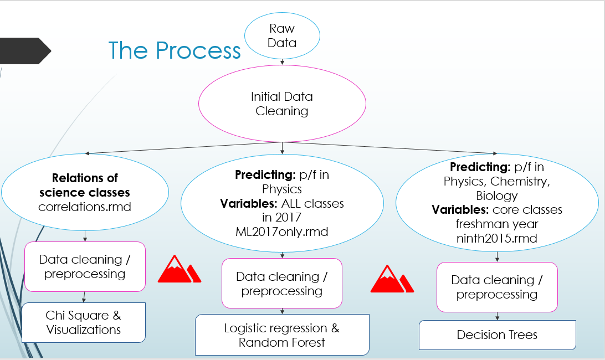
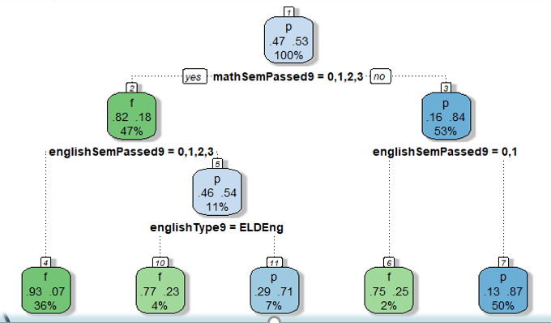

# Predicting Science Outcomes Practicum Project
### Yekaterina Bardash
### Regis University
### October 16, 2018

## Overview

Each year high schools make course decisions about what is best for their students. The purpose of this project was two-fold. The first was to provide insight as to how students are performing in Physics, Chemistry, and Biology classes and what is the relationship in performance. The second purpose was my own interest in whether or not I could predict success in one of the science classes based on student grade and demographic information.

### Motivation
I worked as a teacher so I was eager to help a school make decisions with my Data Science skills. I am also very familiar with student grade information so this was interesting to work with.

### Data

#### Data Source:

The data was provided with permission from a school.

##### Data Scope:

The raw data consisted of 175,353 rows and 125 columns for 3 school years from 2015-2017. Each row represented a transcript entry for an individual class a student took by quarter.

##### Cleaning & Analysis

**1. Determine which columns of data to use and recode variables.**

- Initially a lot of time was spent reviewing the 125 variables provided and determining which would be useful in a ML model. The file initialEDA.rmd contains the initial selection of variables as well as recoding categorical variables as well as creating a numeric score column for grading. This file is not include in this portfolio because of potentially sensitive information. This cleaned version was kept as an rds and saved to be used a jumping off point for other areas of analysis.

**2. Clean data**

- Because of the nature of the data I had to clean and process the data differently depending on my goal. Since my purpose was to look at science classes, I only needed to select certain classes for certain years and clean and work with those. The reason I didn't just create one complete data set with each class representing a column in one shot is because there would have been hundreds of columns representing all the classes that were available over the course of 3 school years. For my sanity, I chose to go through subsetting and cleaning the data per task.
    + Each "cleaning" consisted of:
        + subsetting out the correct year and school
        + searching for appropriate classes (ie. Physics)
        + determining how many sections of classes there were (ie. Honors Physics, Physics, AP Physics, etc)
        + recoding all sections to represent whether the student passed (A, B, C) or failed (D, F) each quarter, then summing up total quarters passed in that class
        + merge demographics
    + ML2017only.rmd looked at all the classes that students who were freshman in 2017 took and tried to predict whether they would pass or fail their physics class.
    + ninth2015.rmd looked at only students who were freshman in 2015 and looked to predict their success in Physics (9th), Chemistry(10th), and Bio(11th) using RandomForests.
    + correlations.rmd looked specifically at relationships between the science classes only and tested the independence of their distributions with a Chi Square Test of Independence.

**3. Create a Random Forest predictive model to determine whether student passed or failed the science class.****

- In ML2017only.rmd all variables were dummy coded because there were so many classes and the data set was very sparse.
- In ninth2015.rmd values were not scaled because most values ranged from 0 to 4. In this model, NA values were removed.
- In both models, data was split into 70/30 training/testing sets and run through the algorithm.
  
**4. Fine tune Random Forest model.**

- There is mixed literature about changing the mtry variable which representes the number of variables available for splitting at each tree node, but I found that setting this hyper parameter to 3 produced the best accuracy for my models. 
- ntree represents the number of trees to grow and after experimenting I kept this hyper parameter at 400 because it did not drastically affect my model positively. 
- Initially I tried to predict exactly the amount of semesters a student passed (0,1,2,3,4) which ranged in accuracy from about 87% in training and about 68% in testing. When I changed the predictor to binary where fail was (1, 2, 3), meaning a student failed at least 1 quarter and pass was (4) meaning the student passed all 4 quarters, the accuracy improve to 92% in training and 86% in testing.

**5. Chi square test of independence betweeen courses.**

- Chi square test of independence were run for all physics courses as well as against core classes.
    + All test returned a p-value <0.001 which rejects the null hypothesis at the distributions of grades are independent. This means grades in one physics class are related to grades in another. 
    
**6. Create Decision Tree model using rpart**

- rpart was ultimately used for predicting Physics, Chemistry, and Biology grades because it is easy to interpret.
- the Complexity Parameter was tuned by used a 10-fold cross validation in all models to determine the number of trees to prune.
- 86% Accuracy was achieved in predicting Physics success with 9th grades
- 77.7% Accuracy was achieved with predicting Chemistry success with 9th grades
- 78% Accuracy was achived with predicting Biology success with 9th grades

### Tools
- R: main coding language for data manipulation and cleaning
- ggplot2 package visualisations in R
- dplyr for data manipulation
- randomForest (bagging algorithm)
- rpart for decision trees
- glm() for logistic regression
- FactoMineR & factoextra pakages in R for Multiple Correspondence Analysis
- XGBoost algorithm for variable importance
- caret package for cross validation
- rpart.plot for better decision tree plots
